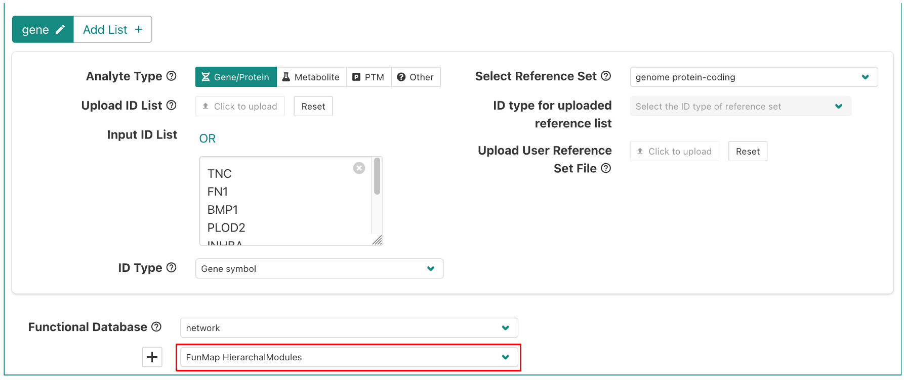
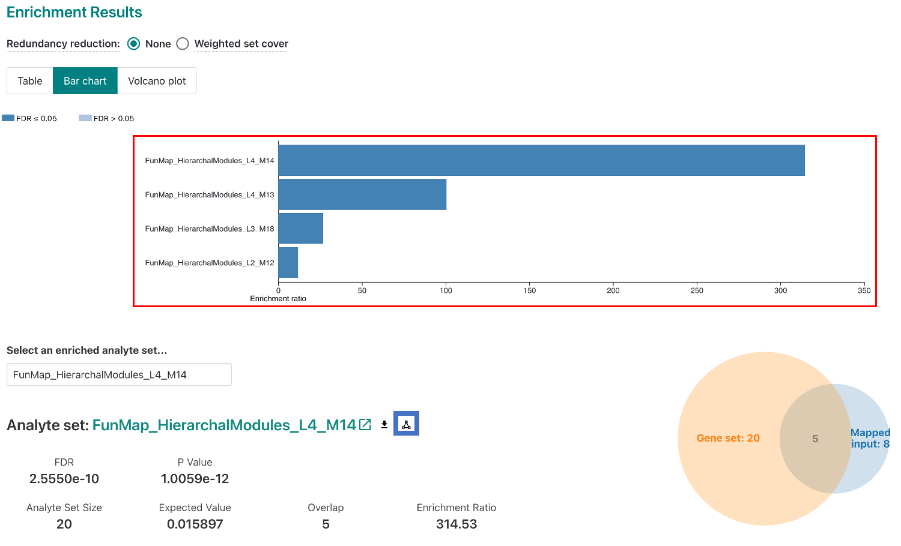
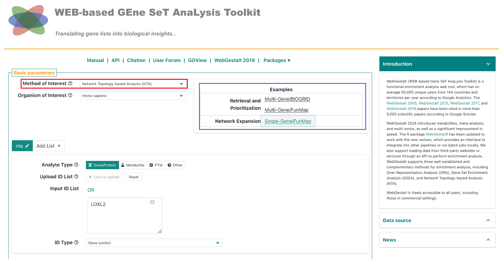
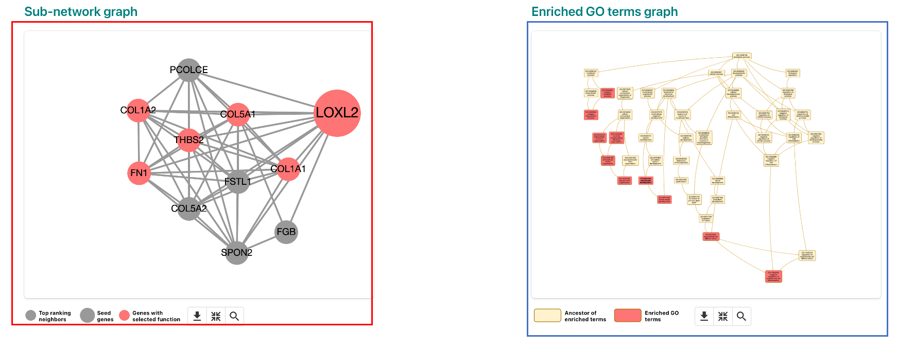

# WebGestalt FunMap Tutorial

## Introduction

[WebGestalt](https://2024.webgestalt.org) is a web-based tool that provides enrichment analysis with support for multiple databases, including FunMap. We have provided multiple examples in webgestalt for FunMap enrichment analysis. In this tutorial, we will show you how to perform FunMap enrichment analysis using WebGestalt.

## Over-Representation Analysis (ORA)

### Set-up

To run ORA with webgestalt, go to [2024.webgestalt.org](https://2024.webgestalt.org), and click on the FunMap example (red box in the figure below). The provided example are the genes that form Clique 160.

By default, the example is set to use the FunMap Hierarchal Modules. You can also select the Dense Modules (Cliques) by clicking on the drop-down menu (red box in the figure below).

After selecting the database, click on the Submit button. You can also modify ORA parameters by clicking on the Advanced Options dropdown.

### Results

The results page will show the top 10 enriched terms. The results page will also show the enrichment plot, which shows the enrichment score for each term. You can click on the elements in the enrichment plot to view the genes in the term (red box). To view a network diagram of a selected module or clique, click on the network icon (blue box).

## Network Topography Analysis (NTA)

### Set-up

First, go to [2024.webgestalt.org](https://2024.webgestalt.org), then in the first dropdown titled "Method of Interest", select "Network Topography Analysis (NTA)" (red box in the figure below). Then, click on either the FunMap example (blue box in the figure below). For the single gene example, we have provided the gene *LOXL2*. For the multi-gene example, we have provided the genes that form Clique 160.

The network expansion examples demonstrate how to use NTA to expand a network based on either a single gene, or multiple genes. See the table below for a description of the network construction methods.

<table>
<thead>
<tr>
  <th style="text-align:center;">Method</th>
  <th style="text-align:center;">Description</th>
</tr>
</thead>
<tbody>
<tr>
  <td style="text-align:center;">Network Retrieval and Prioritization</td>
  <td style="text-align:center;">Uses random walk analysis to calculate random walk probability for the input
seeds, then identifies the relationships among the seeds in the selected network
and returns a retrieval sub-network. The seeds with the top random walk
probability are highlighted in the sub-network.</td>
</tr>
<tr>
  <td style="text-align:center;">Network Expansion</td>
  <td style="text-align:center;">Uses
random walk analysis to rank all genes in the selected network based on their
network proximity to the input seeds and then returns an expanded sub-network
in which nodes are the input seeds and their top ranking neighbors and edges
represent their relationships.</td>
</tr>
</tbody>
<caption>Description of network construction methods (see the <a href="https://2024.webgestalt.org/WG_2024_manual.pdf">WebGestalt manual</a> for more) </caption>
</table>

### Results

For this example, we will use the Network Expansion method with the single gene *LOXL2*. In the results page (shown below), the results page features a sub-network graph representing the network identified in the analysis (red box). On the right side, you can view the GO terms for the network (blue box). If you click on an enriched GO term, the network graph will highlight the genes in the term. In the below image, <code>GO:0001568 - blood vessel development</code> is selected.

